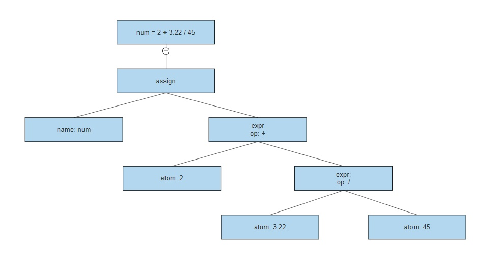

# Grammar-Kit specification
## Examples
* Grammar description for lexer:
```
lexer{
    namespace "mylang\lexer";
    classname "MyLangLexer";

    patterns{
        PLUS '+';
        MINUS '-';
        MUL '*';
        DIV '/';
        REM '%';

        EQ '=';

        INT [1-9]+ [0-9]*;
        FLOAT INT '.' [0-9]+;

        ID [a-zA-Z_]+[a-zA-Z_0-9]*;

        WHITESPACE [\s\t\r\n]+ => channel(HIDDEN);
    }
}
```
Example code:
```
int = 2
float = 4.2
result = float - int + float * int / float
```
Output:
```
ID(int), WHITESPACE(' '), EQ('='), WHITESPACE(' '), INT(2), WHITESPACE('\n'),
ID(float), WHITESPACE(' '), EQ('='), WHITESPACE(' '), FLOAT(4.2), WHITESPACE('\n'),
ID(result), WHITESPACE(' '), EQ('='), WHITESPACE(' '), 
ID('float'), WHITESPACE(' '), MINUS('-'), WHITESPACE(' '),
ID('int'), WHITESPACE(' '), PLUS('+'), WHITESPACE(' '),
ID('float'), WHITESPACE(' '), MUL('*'), WHITESPACE(' '),
ID('int'), WHITESPACE(' '), DIV('/'), WHITESPACE(' '),
ID('float')
```

* Grammar description for parser:
```
parser{
    namespace "mylang\parser";
    classname "MyLangParser";
    lexer "mylang\lexer\MyLangLexer";

    rules{
        assign{
            id EQ expr
        }

        expr{
            term ((MUL|DIV|REM) term)*
        }

        term{
            unary ((MUL|DIV|REM) unary)*
        }

        unary{
            ((PLUS|MINUS) atom) | atom
        }

        atom{
            ID | INT | FLOAT
        }
    }
}
```
Example tree:

